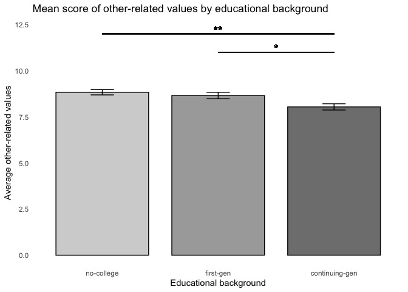
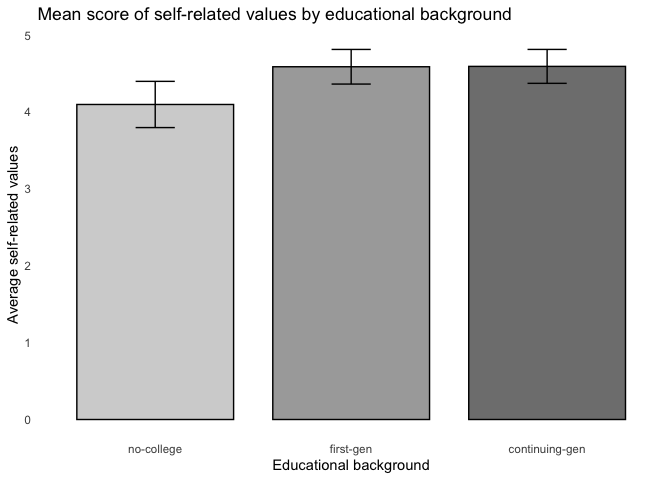
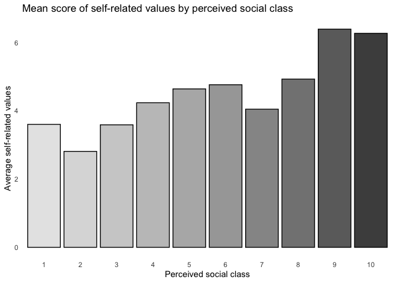

Characterizing Individual Values Across Diverse Educational Backgrounds
and Socioeconomic Statuses
================
Xuanzhou Du
2024-11-07

# 1 Summary

- **Study Overview:** This study (N = 220) investigates the relationship
  between first-generation college status and values categorized as
  self-transcending (other-related) and self-enhancing (self-related).
  It also explores whether similar patterns exist between the subjective
  “ladder” measurement of socio-economic status (SES) and these values,
  as well as the potential impact of compassion and affirmation
  manipulations on these relationships.  
- **Measurement of Values:** The pursuit of other-related values was
  assessed by calculating the mean scores of
  “Value_T1_scale_Compassion_Kindness,” “Value_T1_scale_Family_Friends,”
  and “Value_T1_scale_Spirituality.” Similarly, self-related values were
  measured using the mean scores of “Value_T1_scale_Power_Status,”
  “Value_T1_scale_Wealth,” and “Value_T1_scale_Fame.” The same
  constructs were measured at T3, and these scores were analyzed to
  determine differences across groups based on first-generation status
  and subjective SES.  
- **Key Findings:** The results indicated that first-generation status
  was strongly associated with other-related values, while subjective
  SES was strongly associated with self-related values.
  - **Other-Related Values:** First-generation participants (n = 74)
    rated other-related values as more important than
    continuing-generation participants (n = 83), with no-college
    participants (n = 63) rating these values even higher.  
  - **Self-Related Values:** A higher perceived SES was related to a
    greater emphasis on self-related values.  
- **Consistency with Previous Research:** The relationship between
  first-generation status and self-transcending values aligns with
  previous findings (e.g., Covarrubias & Fryberg, 2015).
  First-generation students often experience more family achievement
  guilt than continuing-generation students, due to feeling privileged
  within their families. However, when first-generation students reflect
  on helping their families, they report less guilt. These findings
  resonate with the emphasis on self-transcending values
  (Compassion_Kindness, Family_Friends, and Spirituality) observed in
  the current study.

# 2 Setup

# 3 Variables

## 3.1 First-generation College Status

Being a first-generation college student means that your parent(s) did
not complete a 4-year college or university degree, regardless of other
family member’s level of education.  
If we want to select people who are/were first-gen college students,
“mother_final_edu” and “father_final_edu” are supposed to be \>=4
(College), and they need to have completed 16 or more years of education
(“eduyrs”\>=16), or they haven’t completed 16 years of education but
aspire to get a college degree (“self_expected_edu”\>=4).  
If one of the parents’ highest education level is missing, then that
person is assumed to be raised in a single-parent family, and the single
parent’s highest education level is enough to determine the person’s
first-generation status. In this data set, a participant didn’t fill in
parents’ education info but explicitly indicated their first-gen
identity in response to “writing”, so that participant was also included
in the first-gen group.

Explanations for the values in the “first_gen_college” column:  
1: no college  
2: first gen  
3: continuing gen

``` r
library(dplyr)
# Create "first_gen_college" column based on the conditions
PA2_SES_FirstGen <- PA2_SES %>%
  mutate(
    first_gen_college = case_when(
      eduyrs >= 16 & mother_final_edu < 4 & father_final_edu < 4 ~ 2,    # first-gen college student: completed college, and both parents didn't
      eduyrs < 16 & self_expected_edu >= 4 & mother_final_edu < 4 & father_final_edu < 4 ~ 2,    # first-gen college student: haven't completed college but aspire to, and both parents didn't
      eduyrs >= 16 & ((mother_final_edu < 4 & is.na(father_final_edu))|(father_final_edu < 4 & is.na(mother_final_edu))) ~ 2,    # first-gen college student: completed college, and were raised by single parent who didn't complete college
      eduyrs < 16 & self_expected_edu >= 4 & ((mother_final_edu < 4 & is.na(father_final_edu))|(father_final_edu < 4 & is.na(mother_final_edu))) ~ 2,    # first-gen college student: haven't completed college but aspire to, and were raised by single parent who didn't complete college
      eduyrs >= 16 & (mother_final_edu >= 4 | father_final_edu >= 4) ~ 3,    # continuing-gen college student: completed college, and at least one of the parents completed college
      eduyrs < 16 & self_expected_edu >= 4 & (mother_final_edu >= 4 | father_final_edu >= 4) ~ 3,    # continuing-gen college student: haven't completed college but aspire to, and at least one of the parents completed college
      eduyrs >= 16 & (((mother_final_edu >= 4) & is.na(father_final_edu)) | ((father_final_edu >= 4) & is.na(mother_final_edu))) ~ 3,    # continuing-gen college student: completed college, and were raised by single parent who completed college
      eduyrs < 16 & self_expected_edu >= 4 & (((mother_final_edu >= 4) & is.na(father_final_edu)) | ((father_final_edu >= 4) & is.na(mother_final_edu))) ~ 3,    # continuing-gen college student: haven't completed college but aspire to, and were raised by single parent who completed college
      eduyrs < 16 & is.na(self_expected_edu) ~ 1,    # not college student: neither attended college nor express any aspiration
      eduyrs < 16 & self_expected_edu < 4 ~ 1,    # not college student: neither attended college nor aspire to do so
      TRUE ~ NA_integer_      # college student without any parents' education info
    )
  )

# Put "first_gen_college" column immediately behind "self_expected_edu" column
PA2_SES_FirstGen <- PA2_SES_FirstGen %>% relocate(first_gen_college, .after = self_expected_edu)

# Confirm the first-gen college status of the NA by looking at their response to "writing".
# subset(PA2_SES_FirstGen, is.na(first_gen_college))$writing
# They explicitly confirm their identity as first-generation college student in their writing, so the NA will be converted to 2 for the first_gen_college variable.
PA2_SES_FirstGen$first_gen_college <- ifelse(is.na(PA2_SES_FirstGen$first_gen_college), 2, PA2_SES_FirstGen$first_gen_college)

# See the distribution in a frequency table including NA 
table(PA2_SES_FirstGen$first_gen_college, useNA = "ifany")
```

    ## 
    ##  1  2  3 
    ## 63 74 83

## 3.2 Value scores

People rated the importance of 6 values. 3 of them were
self-transcending and 3 self-enhancing.  
For now, let’s call them “self” and “other” values and create mean
scores as “value_other_T1” and “value_self_T1” variables.  
Overall, the participants (N=220) scored higher in value_other_T1 (*M* =
8.47, *SD* = 1.46) than in value_self_T1 (*M* = 4.45, *SD* = 2.10).

``` r
# Calculate the mean scores using rowMeans
FirstGen_values <- PA2_SES_FirstGen %>%
  mutate(
    value_other_T1 = rowMeans(across(c(Value_T1_scale_Compassion_Kindness, Value_T1_scale_Family_Friends, Value_T1_scale_Spirituality)), na.rm = TRUE),
    value_self_T1 = rowMeans(across(c(Value_T1_scale_Power_Status, Value_T1_scale_Wealth, Value_T1_scale_Fame)), na.rm = TRUE)
  )
# Compute summary statistics for value_other_T1 & value_self_T1
summary_other_T1 <- data.frame(
  Min = min(FirstGen_values$value_other_T1, na.rm = TRUE),
  Q1 = quantile(FirstGen_values$value_other_T1, 0.25, na.rm = TRUE),
  Median = median(FirstGen_values$value_other_T1, na.rm = TRUE),
  Mean = mean(FirstGen_values$value_other_T1, na.rm = TRUE),
  Q3 = quantile(FirstGen_values$value_other_T1, 0.75, na.rm = TRUE),
  Max = max(FirstGen_values$value_other_T1, na.rm = TRUE),
  SD = sd(FirstGen_values$value_other_T1, na.rm = TRUE)
)

summary_self_T1 <- data.frame(
  Min = min(FirstGen_values$value_self_T1, na.rm = TRUE),
  Q1 = quantile(FirstGen_values$value_self_T1, 0.25, na.rm = TRUE),
  Median = median(FirstGen_values$value_self_T1, na.rm = TRUE),
  Mean = mean(FirstGen_values$value_self_T1, na.rm = TRUE),
  Q3 = quantile(FirstGen_values$value_self_T1, 0.75, na.rm = TRUE),
  Max = max(FirstGen_values$value_self_T1, na.rm = TRUE),
  SD = sd(FirstGen_values$value_self_T1, na.rm = TRUE)
)

# Combine the summaries into a single data frame
combined_summary <- rbind(
  value_other_T1 = summary_other_T1,
  value_self_T1 = summary_self_T1)

# Print the combined summary table using kable()
kable(combined_summary, caption = "Summary Statistics of value_other_T1 and value_self_T1")
```

|                |      Min |       Q1 |   Median |     Mean |       Q3 | Max |       SD |
|:---------------|---------:|---------:|---------:|---------:|---------:|----:|---------:|
| value_other_T1 | 1.333333 | 7.666667 | 9.000000 | 8.471212 | 9.666667 |  10 | 1.463467 |
| value_self_T1  | 0.000000 | 3.000000 | 4.333333 | 4.446970 | 6.000000 |  10 | 2.102574 |

Summary Statistics of value_other_T1 and value_self_T1

## 3.3 Subjective “ladder” measurement of socio-economic status (SES)

``` r
# Compute summary statistics
summary_SES <- data.frame(
  Min = min(FirstGen_values$SES, na.rm = TRUE),
  Q1 = quantile(FirstGen_values$SES, 0.25, na.rm = TRUE),
  Median = median(FirstGen_values$SES, na.rm = TRUE),
  Mean = mean(FirstGen_values$SES, na.rm = TRUE),
  Q3 = quantile(FirstGen_values$SES, 0.75, na.rm = TRUE),
  Max = max(FirstGen_values$SES, na.rm = TRUE),
  SD = sd(FirstGen_values$SES, na.rm = TRUE),
  row.names = "SES"
)

kable(summary_SES, caption = "Summary Statistics of SES", row.names = TRUE)
```

|     | Min |  Q1 | Median |     Mean |  Q3 | Max |       SD |
|:----|----:|----:|-------:|---------:|----:|----:|---------:|
| SES |   1 |   4 |      6 | 5.622727 |   7 |  10 | 1.946413 |

Summary Statistics of SES

``` r
# view the mean value scores by edu background
summary_value_T1_byedu <- data.frame(
  other_1 = c(mean(FirstGen_values$value_other_T1[FirstGen_values$first_gen_college == 1], na.rm = TRUE),
              sd(FirstGen_values$value_other_T1[FirstGen_values$first_gen_college == 1], na.rm = TRUE)),
  other_2 = c(mean(FirstGen_values$value_other_T1[FirstGen_values$first_gen_college == 2], na.rm = TRUE),
              sd(FirstGen_values$value_other_T1[FirstGen_values$first_gen_college == 2], na.rm = TRUE)),
  other_3 = c(mean(FirstGen_values$value_other_T1[FirstGen_values$first_gen_college == 3], na.rm = TRUE),
              sd(FirstGen_values$value_other_T1[FirstGen_values$first_gen_college == 3], na.rm = TRUE)),
  self_1 = c(mean(FirstGen_values$value_self_T1[FirstGen_values$first_gen_college == 1], na.rm = TRUE),
             sd(FirstGen_values$value_self_T1[FirstGen_values$first_gen_college == 1], na.rm = TRUE)),
  self_2 = c(mean(FirstGen_values$value_self_T1[FirstGen_values$first_gen_college == 2], na.rm = TRUE),
             sd(FirstGen_values$value_self_T1[FirstGen_values$first_gen_college == 2], na.rm = TRUE)),
  self_3 = c(mean(FirstGen_values$value_self_T1[FirstGen_values$first_gen_college == 3], na.rm = TRUE),
             sd(FirstGen_values$value_self_T1[FirstGen_values$first_gen_college == 3], na.rm = TRUE))
)

# Add row names for clarity
rownames(summary_value_T1_byedu) <- c("Mean", "SD")

summary_value_T1_byedu
```

    ##       other_1  other_2  other_3   self_1   self_2   self_3
    ## Mean 8.830688 8.653153 8.036145 4.095238 4.585586 4.590361
    ## SD   1.142018 1.516464 1.538144 2.384559 1.936441 2.009008

## 3.4 A correlation table for first-gen status, SES, other-related values, and self-related values

The correlation table indicates that there isn’t association between
first-gen status and SES, and there isn’t association between
other-related and self-related values.  
There is a weak positive correlation (r = 0.23) between SES and
self-related values, which is statistically significant (p \< 0.001).
This suggests that although the relationship is weak, it is very
unlikely to have occurred by chance, indicating that higher SES is
associated with higher scores on the self-related values.  
There is a weak negative correlation (r = -0.23) between first-gen
status and other-related values, which is statistically significant (p
\< 0.01). This suggests that although the relationship is weak, it is
very unlikely to have occurred by chance, indicating that a lower status
regarding the college degree accessibility is associated with higher
scores on the other-related values.

``` r
# Select the variables 
selected_data <- data.frame(
  FirstGen_values$first_gen_college, 
  FirstGen_values$SES, 
  FirstGen_values$value_other_T1, 
  FirstGen_values$value_self_T1
)

# Rename columns for better readability
colnames(selected_data) <- c("first-gen status", "SES", "other-related values T1", "self-related values T1")

# Calculate correlation matrix and p-values
correlation_results <- rcorr(as.matrix(selected_data))
correlation_matrix <- correlation_results$r
p_values <- correlation_results$P

# Create a formatted table
correlation_df <- as.data.frame(round(correlation_matrix, 2))
p_values_df <- as.data.frame(round(p_values, 3))

# Print the correlation matrix
kable(correlation_df, caption = "Correlation table for first-gen status, SES, other-related values T1, and self-related values T1") 
```

|                         | first-gen status |   SES | other-related values T1 | self-related values T1 |
|:------------------------|-----------------:|------:|------------------------:|-----------------------:|
| first-gen status        |             1.00 | -0.05 |                   -0.23 |                   0.09 |
| SES                     |            -0.05 |  1.00 |                   -0.04 |                   0.23 |
| other-related values T1 |            -0.23 | -0.04 |                    1.00 |                  -0.08 |
| self-related values T1  |             0.09 |  0.23 |                   -0.08 |                   1.00 |

Correlation table for first-gen status, SES, other-related values T1,
and self-related values T1

``` r
# Print p-values below the correlation matrix to see which correlations are statistically significant
kable(p_values_df, caption = "P-values for Correlation Coefficients") 
```

|                         | first-gen status |   SES | other-related values T1 | self-related values T1 |
|:------------------------|-----------------:|------:|------------------------:|-----------------------:|
| first-gen status        |               NA | 0.483 |                   0.001 |                  0.178 |
| SES                     |            0.483 |    NA |                   0.605 |                  0.000 |
| other-related values T1 |            0.001 | 0.605 |                      NA |                  0.237 |
| self-related values T1  |            0.178 | 0.000 |                   0.237 |                     NA |

P-values for Correlation Coefficients

``` r
# Spearman 
cor.test(FirstGen_values$first_gen_college, FirstGen_values$SES, method = "spearman")
```

    ## 
    ##  Spearman's rank correlation rho
    ## 
    ## data:  FirstGen_values$first_gen_college and FirstGen_values$SES
    ## S = 1820957, p-value = 0.7002
    ## alternative hypothesis: true rho is not equal to 0
    ## sample estimates:
    ##         rho 
    ## -0.02610522

## 3.5 Condition and a new variable “cond_affirm” (\*For EPA submission: Only focused on A = affirmed with the highest ranked value)

For the Affirmation and Control conditions, some people were affirmed
with self-related values and others other-related values, regardless of
their conditions. This is because A involved affirming with the
participant’s highest ranked value, and C involved affirming with the
participant’s lowest ranked value. We are interested in how people
reason about their highest ranked value in this study.

“condition”:  
A = affirmed with the highest ranked value  
C = affirmed with the lowest ranked value  
M = did compassion practice

``` r
df_PA2 <- FirstGen_values %>%
  mutate(
    cond_affirm = case_when(
      condition == "A" & ((Value_T1_rank_Power_Status == 1) | (Value_T1_rank_Wealth == 1) | (Value_T1_rank_Fame == 1)) ~ "self",
      condition == "C" & ((Value_T1_rank_Power_Status == 6) | (Value_T1_rank_Wealth == 6) | (Value_T1_rank_Fame == 6)) ~ "self",
      condition == "C" & ((Value_T1_rank_Compassion_Kindness == 6) | (Value_T1_rank_Family_Friends == 6) | (Value_T1_rank_Spirituality == 6)) ~ "other",
      condition == "A" & ((Value_T1_rank_Compassion_Kindness == 1) | (Value_T1_rank_Family_Friends == 1) | (Value_T1_rank_Spirituality == 1)) ~ "other",
      condition == "M" ~ "compassion",
      TRUE ~ NA_character_  
     )) %>%
  mutate(
    cond_affirm = factor(cond_affirm, levels = c("self", "other", "compassion"))
  )

# See the distribution in a frequency table of condition
table(df_PA2$condition, useNA = "ifany")
```

    ## 
    ##  A  C  M 
    ## 88 88 44

“cond_affirm”:  
other = affirmed other-values  
self = affirmed self-values  
compassion = did compassion practice

``` r
table(df_PA2$cond_affirm, useNA = "ifany")
```

    ## 
    ##       self      other compassion 
    ##         78         98         44

### 3.5.1 Distribution of participants in each condition/cond_affirm by their first-gen status/SES

``` r
# check if there is missing data in the column of values_other_T1 and value_self_T1
sum(is.na(df_PA2$value_other_T1))
sum(is.na(df_PA2$value_self_T1))
```

T1 Distribution:

``` r
# T1
table(df_PA2$condition, df_PA2$first_gen_college, useNA = "ifany")
```

    ##    
    ##      1  2  3
    ##   A 20 34 34
    ##   C 31 25 32
    ##   M 12 15 17

``` r
table(df_PA2$condition, df_PA2$SES, useNA = "ifany")
```

    ##    
    ##      1  2  3  4  5  6  7  8  9 10
    ##   A  1  3 10 13 18 13 16  9  2  3
    ##   C  2  1  7 13 14 25 11 11  2  2
    ##   M  2  3  4  4  4  8 10  7  2  0

``` r
table(df_PA2$cond_affirm, df_PA2$first_gen_college, useNA = "ifany")
```

    ##             
    ##               1  2  3
    ##   self       28 23 27
    ##   other      23 36 39
    ##   compassion 12 15 17

``` r
table(df_PA2$cond_affirm, df_PA2$SES, useNA = "ifany")
```

    ##             
    ##               1  2  3  4  5  6  7  8  9 10
    ##   self        2  1  7 13 14 18  9 11  2  1
    ##   other       1  3 10 13 18 20 18  9  2  4
    ##   compassion  2  3  4  4  4  8 10  7  2  0

# 4 First-gen status, SES, and T1 values

We are interested in whether the first-gen status or subjective measures
of SES, or both predicted participants’ pursuit of other-related (or
self-related) values at T1.

## 4.1 First-gen status and values

### 4.1.1 First-gen status and other-related values

According to the results of ANOVA and linear regression (N=220),
compared to the no-college group, continuing-gen group had a lower
value_other_T1, ( $\beta$ = -0.79, SE = 0.24, t = -3.33, p \< 0.01 ),
and compared to the first-gen group, continuing-gen group also had a
lower value_other_T1, ( $\beta$ = -0.62, SE = 0.23, t = -2.70, p \< 0.01
). There’s no significant difference between no-college and first-gen
groups, ( $\beta$ = -0.18, SE = 0.24, t = -0.73, p = 0.47 ).  
The pattern was demonstrated in the bar plot.

``` r
# Run ANOVA
anova_result_other <- aov(value_other_T1 ~ as.factor(first_gen_college), data = df_PA2)
summary(anova_result_other)
```

    ##                               Df Sum Sq Mean Sq F value  Pr(>F)   
    ## as.factor(first_gen_college)   2   26.3   13.15   6.446 0.00191 **
    ## Residuals                    217  442.7    2.04                   
    ## ---
    ## Signif. codes:  0 '***' 0.001 '**' 0.01 '*' 0.05 '.' 0.1 ' ' 1

``` r
# Perform post hoc test
TukeyHSD(anova_result_other)
```

    ##   Tukey multiple comparisons of means
    ##     95% family-wise confidence level
    ## 
    ## Fit: aov(formula = value_other_T1 ~ as.factor(first_gen_college), data = df_PA2)
    ## 
    ## $`as.factor(first_gen_college)`
    ##           diff        lwr         upr     p adj
    ## 2-1 -0.1775347 -0.7553823  0.40031292 0.7489216
    ## 3-1 -0.7945433 -1.3577998 -0.23128667 0.0029318
    ## 3-2 -0.6170086 -1.1559407 -0.07807643 0.0202669

``` r
# Run linear regression
lm_result_other <- lm(value_other_T1 ~ as.factor(first_gen_college), data = df_PA2)
summary(lm_result_other)
```

    ## 
    ## Call:
    ## lm(formula = value_other_T1 ~ as.factor(first_gen_college), data = df_PA2)
    ## 
    ## Residuals:
    ##     Min      1Q  Median      3Q     Max 
    ## -7.3198 -0.8307  0.3220  1.1693  1.9639 
    ## 
    ## Coefficients:
    ##                               Estimate Std. Error t value Pr(>|t|)    
    ## (Intercept)                     8.8307     0.1800  49.071  < 2e-16 ***
    ## as.factor(first_gen_college)2  -0.1775     0.2449  -0.725  0.46921    
    ## as.factor(first_gen_college)3  -0.7945     0.2387  -3.329  0.00102 ** 
    ## ---
    ## Signif. codes:  0 '***' 0.001 '**' 0.01 '*' 0.05 '.' 0.1 ' ' 1
    ## 
    ## Residual standard error: 1.428 on 217 degrees of freedom
    ## Multiple R-squared:  0.05607,    Adjusted R-squared:  0.04737 
    ## F-statistic: 6.446 on 2 and 217 DF,  p-value: 0.001909

``` r
# Run linear regression with first-gen as reference level 
lm_result_other_relevel <- lm(value_other_T1 ~ relevel(as.factor(first_gen_college), ref = "2"), data = df_PA2)
summary(lm_result_other_relevel)
```

    ## 
    ## Call:
    ## lm(formula = value_other_T1 ~ relevel(as.factor(first_gen_college), 
    ##     ref = "2"), data = df_PA2)
    ## 
    ## Residuals:
    ##     Min      1Q  Median      3Q     Max 
    ## -7.3198 -0.8307  0.3220  1.1693  1.9639 
    ## 
    ## Coefficients:
    ##                                                   Estimate Std. Error t value
    ## (Intercept)                                         8.6532     0.1660  52.113
    ## relevel(as.factor(first_gen_college), ref = "2")1   0.1775     0.2449   0.725
    ## relevel(as.factor(first_gen_college), ref = "2")3  -0.6170     0.2284  -2.702
    ##                                                   Pr(>|t|)    
    ## (Intercept)                                        < 2e-16 ***
    ## relevel(as.factor(first_gen_college), ref = "2")1  0.46921    
    ## relevel(as.factor(first_gen_college), ref = "2")3  0.00744 ** 
    ## ---
    ## Signif. codes:  0 '***' 0.001 '**' 0.01 '*' 0.05 '.' 0.1 ' ' 1
    ## 
    ## Residual standard error: 1.428 on 217 degrees of freedom
    ## Multiple R-squared:  0.05607,    Adjusted R-squared:  0.04737 
    ## F-statistic: 6.446 on 2 and 217 DF,  p-value: 0.001909

``` r
# Ensure 'first_gen_college' is a factor
df_PA2$first_gen_college <- as.factor(df_PA2$first_gen_college)
# plot other-related value by educational background
ggplot(df_PA2, aes(x = first_gen_college, y = value_other_T1, 
                   fill = first_gen_college)) +
  geom_bar(stat = "summary", fun = "mean", position = position_dodge(width = 0.9), 
           color = "black", width = 0.8) +  # Bars without space between them
  geom_errorbar(stat = "summary", fun.data = mean_se, width = 0.2, 
                position = position_dodge(width = 0.9)) +
  labs(title = "Mean score of other-related values by educational background",
       x = "First-gen status",
       y = "Average other-related values") +
  theme_minimal() +
  scale_x_discrete(name = "Educational background",
                   labels = c("no-college", "first-gen", "continuing-gen")) +
  scale_fill_manual(values = c("0" = "white",     # no college
                               "1" = "lightgray", # first-gen
                               "2" = "darkgray")) + # continuing-gen
  theme(legend.position = "none", 
        panel.grid = element_blank()) +  # Remove grid lines
  
  # Add significance lines and star annotations
  geom_segment(aes(x = 2, xend = 3, y = max(df_PA2$value_other_T1) + 1, yend = max(df_PA2$value_other_T1) + 1)) +  # Line for first-gen vs. continuing-gen (one star)
  geom_text(aes(x = 2.5, y = max(df_PA2$value_other_T1) + 1.2, label = "*"), size = 5) +  # One star for first-gen vs. continuing-gen (p < 0.05)

  geom_segment(aes(x = 1, xend = 3, y = max(df_PA2$value_other_T1) + 2, yend = max(df_PA2$value_other_T1) + 2)) +  # Line for no-college vs. continuing-gen (two stars)
  geom_text(aes(x = 2, y = max(df_PA2$value_other_T1) + 2.2, label = "**"), size = 5)   # Two stars for no-college vs. continuing-gen (p < 0.01)
```

<!-- -->

### 4.1.2 First-gens status and self-related values

According to the results of ANOVA and linear regression (N=220),
regarding the means of self-related values, there’s no significant
difference between the three groups. The ANOVA results indicated no
significant effect of group, $F(2, 217) = 1.24, p = 0.29, η² = 0.01$.  
The bar plot showed that both first-gen and continuing-gen groups
attributed slightly greater importance to self-related values than
no-college group.

``` r
# Run ANOVA
anova_result_self <- aov(value_self_T1 ~ as.factor(first_gen_college), data = df_PA2)
summary(anova_result_self)
```

    ##                               Df Sum Sq Mean Sq F value Pr(>F)
    ## as.factor(first_gen_college)   2   10.9   5.461   1.238  0.292
    ## Residuals                    217  957.2   4.411

``` r
# Calculate effect size (eta squared)
eta_squared_value <- car::Anova(anova_result_self, type="II")$"Sum Sq"[1] / sum(car::Anova(anova_result_self, type="II")$"Sum Sq")
eta_squared_value 
```

    ## [1] 0.01128171

``` r
# Run linear regression
lm_result_self <- lm(value_self_T1 ~ as.factor(first_gen_college), data = df_PA2)
summary(lm_result_self)
```

    ## 
    ## Call:
    ## lm(formula = value_self_T1 ~ as.factor(first_gen_college), data = df_PA2)
    ## 
    ## Residuals:
    ##     Min      1Q  Median      3Q     Max 
    ## -4.5904 -1.2570 -0.2523  1.4144  5.9048 
    ## 
    ## Coefficients:
    ##                               Estimate Std. Error t value Pr(>|t|)    
    ## (Intercept)                     4.0952     0.2646  15.476   <2e-16 ***
    ## as.factor(first_gen_college)2   0.4903     0.3600   1.362    0.175    
    ## as.factor(first_gen_college)3   0.4951     0.3510   1.411    0.160    
    ## ---
    ## Signif. codes:  0 '***' 0.001 '**' 0.01 '*' 0.05 '.' 0.1 ' ' 1
    ## 
    ## Residual standard error: 2.1 on 217 degrees of freedom
    ## Multiple R-squared:  0.01128,    Adjusted R-squared:  0.002169 
    ## F-statistic: 1.238 on 2 and 217 DF,  p-value: 0.292

``` r
# Run linear regression with the desired reference level specified in the formula
lm_result_self_relevel <- lm(value_self_T1 ~ relevel(as.factor(first_gen_college), ref = "2"), data = df_PA2)
summary(lm_result_self_relevel)
```

    ## 
    ## Call:
    ## lm(formula = value_self_T1 ~ relevel(as.factor(first_gen_college), 
    ##     ref = "2"), data = df_PA2)
    ## 
    ## Residuals:
    ##     Min      1Q  Median      3Q     Max 
    ## -4.5904 -1.2570 -0.2523  1.4144  5.9048 
    ## 
    ## Coefficients:
    ##                                                    Estimate Std. Error t value
    ## (Intercept)                                        4.585586   0.244154  18.782
    ## relevel(as.factor(first_gen_college), ref = "2")1 -0.490347   0.360043  -1.362
    ## relevel(as.factor(first_gen_college), ref = "2")3  0.004776   0.335795   0.014
    ##                                                   Pr(>|t|)    
    ## (Intercept)                                         <2e-16 ***
    ## relevel(as.factor(first_gen_college), ref = "2")1    0.175    
    ## relevel(as.factor(first_gen_college), ref = "2")3    0.989    
    ## ---
    ## Signif. codes:  0 '***' 0.001 '**' 0.01 '*' 0.05 '.' 0.1 ' ' 1
    ## 
    ## Residual standard error: 2.1 on 217 degrees of freedom
    ## Multiple R-squared:  0.01128,    Adjusted R-squared:  0.002169 
    ## F-statistic: 1.238 on 2 and 217 DF,  p-value: 0.292

``` r
# plot self-related value by educational background
ggplot(df_PA2, aes(x = first_gen_college, y = value_self_T1, 
                   fill = first_gen_college)) +
  geom_bar(stat = "summary", fun = "mean", position = position_dodge(width = 0.9), 
           color = "black", width = 0.8) +  # Bars without space between them
  geom_errorbar(stat = "summary", fun.data = mean_se, width = 0.2, 
                position = position_dodge(width = 0.9)) +
  labs(title = "Mean score of self-related values by educational background",
       x = "First-gen status",
       y = "Average self-related values") +
  theme_minimal() +
  scale_x_discrete(name = "Educational background",
                   labels = c("no-college", "first-gen", "continuing-gen")) +
  scale_fill_manual(values = c("0" = "white",     # no college
                               "1" = "lightgray", # first-gen
                               "2" = "darkgray")) + # continuing-gen
  theme(legend.position = "none", 
        panel.grid = element_blank())  # Remove grid lines
```

<!-- -->

## 4.2 SES and values

We are interested in whether the subjective measures of SES predicted
participants’ pursuit of other-related (or self-related) values.

### 4.2.1 SES and other-related values

The results of ANOVA and linear regression (N=220) indicated that the
pursuit of other-related values doesn’t demonstrate any significant
difference across different levels of SES. The relationship between
`SES` and `value_other_T1` was not significant, ( $\beta$ = -0.03, t =
-0.52, p = 0.61 ).

``` r
summary(aov(value_other_T1 ~ as.factor(SES), df_PA2))
```

    ##                 Df Sum Sq Mean Sq F value Pr(>F)
    ## as.factor(SES)   9   10.9   1.209   0.554  0.833
    ## Residuals      210  458.2   2.182

``` r
summary(lm(value_other_T1 ~ SES, df_PA2))
```

    ## 
    ## Call:
    ## lm(formula = value_other_T1 ~ SES, data = df_PA2)
    ## 
    ## Residuals:
    ##     Min      1Q  Median      3Q     Max 
    ## -7.1015 -0.8210  0.4596  1.1856  1.6443 
    ## 
    ## Coefficients:
    ##             Estimate Std. Error t value Pr(>|t|)    
    ## (Intercept)  8.61956    0.30274  28.472   <2e-16 ***
    ## SES         -0.02638    0.05089  -0.518    0.605    
    ## ---
    ## Signif. codes:  0 '***' 0.001 '**' 0.01 '*' 0.05 '.' 0.1 ' ' 1
    ## 
    ## Residual standard error: 1.466 on 218 degrees of freedom
    ## Multiple R-squared:  0.001231,   Adjusted R-squared:  -0.00335 
    ## F-statistic: 0.2687 on 1 and 218 DF,  p-value: 0.6047

### 4.2.2 SES and self-related values

The results of ANOVA and linear regression (N=220) indicated that
participants of higher SES attributed significantly greater importance
to self-related values, ( $\beta$ = 0.25, t = 3.55, p \< 0.001 ).  
The bar plot demonstrated the overall positive relationship between SES
and pursuits of self-related values.

``` r
summary(aov(value_self_T1 ~ as.factor(SES), df_PA2))
```

    ##                 Df Sum Sq Mean Sq F value  Pr(>F)   
    ## as.factor(SES)   9   96.5  10.717   2.582 0.00769 **
    ## Residuals      210  871.7   4.151                   
    ## ---
    ## Signif. codes:  0 '***' 0.001 '**' 0.01 '*' 0.05 '.' 0.1 ' ' 1

``` r
summary(lm(value_self_T1 ~ SES, df_PA2))
```

    ## 
    ## Call:
    ## lm(formula = value_self_T1 ~ SES, data = df_PA2)
    ## 
    ## Residuals:
    ##     Min      1Q  Median      3Q     Max 
    ## -4.5422 -1.4006 -0.0017  1.3769  5.7102 
    ## 
    ## Coefficients:
    ##             Estimate Std. Error t value Pr(>|t|)    
    ## (Intercept)  3.02766    0.42317   7.155 1.26e-11 ***
    ## SES          0.25242    0.07114   3.548 0.000475 ***
    ## ---
    ## Signif. codes:  0 '***' 0.001 '**' 0.01 '*' 0.05 '.' 0.1 ' ' 1
    ## 
    ## Residual standard error: 2.049 on 218 degrees of freedom
    ## Multiple R-squared:  0.0546, Adjusted R-squared:  0.05027 
    ## F-statistic: 12.59 on 1 and 218 DF,  p-value: 0.0004746

``` r
ggplot(df_PA2, aes(x = as.factor(SES), y = value_self_T1, fill = as.factor(SES))) +
  geom_bar(stat = "summary", fun = "mean", position = "dodge", color = "black") +  # Add black borders
  labs(title = "Mean score of self-related values by perceived social class",
       x = "Perceived social class",
       y = "Average self-related values") +
  theme_minimal() +
  scale_fill_manual(values = rev(gray.colors(10))) +  # Reverse shades of gray
  theme(legend.position = "none", 
        panel.grid = element_blank())  # Remove grid lines
```

<!-- -->

## 4.3 Values with both first-gen status and SES

The analyses of variance indicated that first-generation status was the
only predictor of other-related values at T1, and that SES was the only
predictor of self-related values at T1.

### 4.3.1 Other-related values with both first-gen status and SES

The analysis of variance and regression results revealed a significant
main effect of first-gen college status on value_other at T1, F(2, 208)
= 6.32, p = .002, indicating that first-gen status was the primary
variable driving the effect. In contrast, SES did not have a significant
impact, F(9, 208) = 0.52, p = 0.858.

``` r
other_model <- lm(value_other_T1 ~ as.factor(first_gen_college) + as.factor(SES), data = df_PA2)
summary(other_model)
```

    ## 
    ## Call:
    ## lm(formula = value_other_T1 ~ as.factor(first_gen_college) + 
    ##     as.factor(SES), data = df_PA2)
    ## 
    ## Residuals:
    ##     Min      1Q  Median      3Q     Max 
    ## -7.0118 -0.8098  0.3036  1.0259  2.2520 
    ## 
    ## Coefficients:
    ##                               Estimate Std. Error t value Pr(>|t|)    
    ## (Intercept)                    8.78933    0.66971  13.124  < 2e-16 ***
    ## as.factor(first_gen_college)2 -0.20552    0.25068  -0.820  0.41324    
    ## as.factor(first_gen_college)3 -0.80259    0.24496  -3.276  0.00123 ** 
    ## as.factor(SES)2                0.02367    0.84621   0.028  0.97771    
    ## as.factor(SES)3                0.15967    0.72007   0.222  0.82473    
    ## as.factor(SES)4                0.06882    0.69777   0.099  0.92152    
    ## as.factor(SES)5                0.41030    0.69217   0.593  0.55398    
    ## as.factor(SES)6               -0.07492    0.68073  -0.110  0.91247    
    ## as.factor(SES)7               -0.23872    0.69023  -0.346  0.72980    
    ## as.factor(SES)8                0.08495    0.70248   0.121  0.90387    
    ## as.factor(SES)9                0.40135    0.87645   0.458  0.64749    
    ## as.factor(SES)10              -0.18770    0.91772  -0.205  0.83814    
    ## ---
    ## Signif. codes:  0 '***' 0.001 '**' 0.01 '*' 0.05 '.' 0.1 ' ' 1
    ## 
    ## Residual standard error: 1.443 on 208 degrees of freedom
    ## Multiple R-squared:  0.07692,    Adjusted R-squared:  0.02811 
    ## F-statistic: 1.576 on 11 and 208 DF,  p-value: 0.1077

``` r
# Print ANOVA table to assess whether each significantly contributes to explaining variability in the other-related values
anova(other_model)
```

    ## Analysis of Variance Table
    ## 
    ## Response: value_other_T1
    ##                               Df Sum Sq Mean Sq F value   Pr(>F)   
    ## as.factor(first_gen_college)   2  26.30 13.1506  6.3177 0.002169 **
    ## as.factor(SES)                 9   9.78  1.0866  0.5220 0.857697   
    ## Residuals                    208 432.96  2.0815                    
    ## ---
    ## Signif. codes:  0 '***' 0.001 '**' 0.01 '*' 0.05 '.' 0.1 ' ' 1

### 4.3.2 Self-related values with both first-gen status and SES

The analysis of variance and regression results suggested that SES was
the primary variable driving the effect on value_self at T1. The ANOVA
table showed a significant effect of SES on value_self,
$F(9, 208) = 2.79, p < 0.01$, while first-gen college status did not
have a significant effect, F(2, 208) = 1.33, p = 0.267. In the
regression model, specific levels of SES, SES9 ( $\beta$ = 2.97, t =
2.41, p \< 0.05 ) and SES10 ( $\beta$ = 2.91, t = 2.26, p \< 0.05 ),
were significantly associated with value_self at T1. These results
indicated that differences in SES were more influential in predicting
value_self at T1 than first-gen college status.

``` r
self_model <- lm(value_self_T1 ~ as.factor(first_gen_college) + as.factor(SES), data = df_PA2)
summary(self_model)
```

    ## 
    ## Call:
    ## lm(formula = value_self_T1 ~ as.factor(first_gen_college) + as.factor(SES), 
    ##     data = df_PA2)
    ## 
    ## Residuals:
    ##     Min      1Q  Median      3Q     Max 
    ## -4.3074 -1.4341 -0.0272  1.4003  5.8438 
    ## 
    ## Coefficients:
    ##                               Estimate Std. Error t value Pr(>|t|)   
    ## (Intercept)                    3.10509    0.94056   3.301  0.00113 **
    ## as.factor(first_gen_college)2  0.66785    0.35206   1.897  0.05921 . 
    ## as.factor(first_gen_college)3  0.60224    0.34403   1.751  0.08150 . 
    ## as.factor(SES)2               -0.83989    1.18844  -0.707  0.48054   
    ## as.factor(SES)3                0.02705    1.01128   0.027  0.97869   
    ## as.factor(SES)4                0.68918    0.97997   0.703  0.48267   
    ## as.factor(SES)5                1.05114    0.97210   1.081  0.28081   
    ## as.factor(SES)6                1.20235    0.95604   1.258  0.20993   
    ## as.factor(SES)7                0.50821    0.96938   0.524  0.60065   
    ## as.factor(SES)8                1.33785    0.98659   1.356  0.17656   
    ## as.factor(SES)9                2.97175    1.23091   2.414  0.01663 * 
    ## as.factor(SES)10               2.90756    1.28887   2.256  0.02512 * 
    ## ---
    ## Signif. codes:  0 '***' 0.001 '**' 0.01 '*' 0.05 '.' 0.1 ' ' 1
    ## 
    ## Residual standard error: 2.026 on 208 degrees of freedom
    ## Multiple R-squared:  0.1179, Adjusted R-squared:  0.07129 
    ## F-statistic: 2.528 on 11 and 208 DF,  p-value: 0.005172

``` r
# Print ANOVA table to assess overall model significance
anova(self_model)
```

    ## Analysis of Variance Table
    ## 
    ## Response: value_self_T1
    ##                               Df Sum Sq Mean Sq F value   Pr(>F)   
    ## as.factor(first_gen_college)   2  10.92  5.4612  1.3302 0.266669   
    ## as.factor(SES)                 9 103.26 11.4737  2.7946 0.004089 **
    ## Residuals                    208 853.97  4.1056                    
    ## ---
    ## Signif. codes:  0 '***' 0.001 '**' 0.01 '*' 0.05 '.' 0.1 ' ' 1

# 5 Word cloud (\*For EPA submission, only focused on three groups’ word clouds)

actual group size (no-college, first-gen, continuing-gen)

``` r
# prepare the data frames containing writings from no-college, first-gen, and continuing-gen
# no-college
affirm_nocollege <- df_PA2 %>%
  filter(
    first_gen_college == 1 &
    condition == "A"
  )
#nrow(affirm_nocollege)
sum(affirm_nocollege$writing != "")
```

    ## [1] 17

``` r
# first-gen
affirm_firstgen <- df_PA2 %>%
  filter(
    first_gen_college == 2 &
    condition == "A"
  )
#nrow(affirm_firstgen)
sum(affirm_firstgen$writing != "")
```

    ## [1] 30

``` r
# continuing-gen
affirm_continuinggen <- df_PA2 %>%
  filter(
    first_gen_college == 3 &
    condition == "A"
  )
#nrow(affirm_continuinggen)
sum(affirm_continuinggen$writing != "")
```

    ## [1] 33

``` r
# Not used for EPA submission
# Word cloud preparation for the Affirmation condition where they ranked other-related values as most important
# Filter the dataset to prepare the subsets of the three groups
affirm_other_df <- df_PA2 %>%
  filter(
    condition == "A" & 
      (Value_T1_rank_Compassion_Kindness == 1 | 
         Value_T1_rank_Family_Friends == 1 | 
         Value_T1_rank_Spirituality == 1)
  )

# no-college
affirm_other_df_1 <- df_PA2 %>%
  filter(
    first_gen_college == 1 &
    condition == "A" & 
      (Value_T1_rank_Compassion_Kindness == 1 | 
         Value_T1_rank_Family_Friends == 1 | 
         Value_T1_rank_Spirituality == 1)
  )
#nrow(affirm_other_df_1)

# first-gen
affirm_other_df_2 <- df_PA2 %>%
  filter(
    first_gen_college == 2 &
    condition == "A" & 
      (Value_T1_rank_Compassion_Kindness == 1 | 
         Value_T1_rank_Family_Friends == 1 | 
         Value_T1_rank_Spirituality == 1)
  )
#nrow(affirm_other_df_2)

# continuing-gen
affirm_other_df_3 <- df_PA2 %>%
  filter(
    first_gen_college == 3 &
    condition == "A" & 
      (Value_T1_rank_Compassion_Kindness == 1 | 
         Value_T1_rank_Family_Friends == 1 | 
         Value_T1_rank_Spirituality == 1)
  )
#nrow(affirm_other_df_3)
```

``` r
# Not used for EPA submission
# Word cloud preparation for Affirmation condition where they ranked self-related values highest.
# Filter the dataset to prepare the subset for the three groups
affirm_self_df <- df_PA2 %>%
  filter(
    condition == "A" & 
      (Value_T1_rank_Power_Status == 1 | 
         Value_T1_rank_Wealth == 1 | 
         Value_T1_rank_Fame == 1)
  )

affirm_self_df_1 <- df_PA2 %>%
  filter(
    first_gen_college == 1 &
    condition == "A" & 
      (Value_T1_rank_Power_Status == 1 | 
         Value_T1_rank_Wealth == 1 | 
         Value_T1_rank_Fame == 1)
  )
#nrow(affirm_self_df_1)

affirm_self_df_2 <- df_PA2 %>%
  filter(
    first_gen_college == 2 &
    condition == "A" & 
      (Value_T1_rank_Power_Status == 1 | 
         Value_T1_rank_Wealth == 1 | 
         Value_T1_rank_Fame == 1)
  )
#nrow(affirm_self_df_2)

affirm_self_df_3 <- df_PA2 %>%
  filter(
    first_gen_college == 3 &
    condition == "A" & 
      (Value_T1_rank_Power_Status == 1 | 
         Value_T1_rank_Wealth == 1 | 
         Value_T1_rank_Fame == 1)
  )
#nrow(affirm_self_df_3)
```

Word clouds

``` r
# Step 1: Function to generate word clouds for a list of data frames
generate_wordclouds <- function(data_frames) {
  for (i in seq_along(data_frames)) {
    # Step 2: Convert the 'writing' column to a character vector
    text_data <- as.character(data_frames[[i]]$writing)
    
    # Step 3: Create a corpus from the text data
    corpus <- Corpus(VectorSource(text_data))
    
    # Step 4: Clean the text data (remove punctuation, stopwords, etc.)
    corpus_clean <- tm_map(corpus, content_transformer(tolower))
    corpus_clean <- tm_map(corpus_clean, removePunctuation)
    corpus_clean <- tm_map(corpus_clean, removeNumbers)
    corpus_clean <- tm_map(corpus_clean, removeWords, stopwords("en"))
    corpus_clean <- tm_map(corpus_clean, stripWhitespace)
    
    # Step 5: Create a Document-Term Matrix (DTM)
    dtm <- TermDocumentMatrix(corpus_clean)
    
    # Step 6: Convert the DTM to a matrix and check word frequencies
    matrix <- as.matrix(dtm)
    word_freq <- sort(rowSums(matrix), decreasing = TRUE)
    
    # If needed, print the word frequencies to ensure it's not empty
    #print(paste("Word frequencies for affirm_self_df_", i, ":", sep = ""))
    #print(word_freq)
    
    # Step 7: Check if word_freq is empty
    if (length(word_freq) == 0) {
      print(paste("No words found in the corpus after cleaning for affirm_self_df_", i, ".", sep = ""))
    } else {
      # Step 8: Generate the Word Cloud if words are present
      set.seed(1234)  # For reproducibility
      wordcloud(
        words = names(word_freq), 
        freq = word_freq, 
        min.freq = 1,          # Adjust to a lower value if needed
        max.words = 50,       # Max number of words to include
        random.order = FALSE,  # Words with higher frequency are centered
        rot.per = 0,  # Set rotation to 0 for all words horizontal
        scale = c(3, 0.3),
        colors = brewer.pal(8, "Dark2")  # Color palette for the words
      )
    }
  }
}

# Generate self-related word clouds for all three data frames
# generate_wordclouds(list(affirm_self_df_1, affirm_self_df_2, affirm_self_df_3))

# Generate other-related word clouds for all three data frames
# generate_wordclouds(list(affirm_other_df_1, affirm_other_df_2, affirm_other_df_3))
```

``` r
# Generate word clouds for three groups
generate_wordclouds(list(affirm_nocollege))
```

<!-- -->

``` r
generate_wordclouds(list(affirm_firstgen))
```

<!-- -->

``` r
generate_wordclouds(list(affirm_continuinggen))
```

<!-- -->

# 6 LIWC (TBD)

``` r
# LIWC Preparation (take affirmation writing as a dataset to feed into LIWC)
# lm(Value_self_transcendent ~ linguistic_feature + Value_self_enhancing + first_gen_college, data = affirm_df)
```
